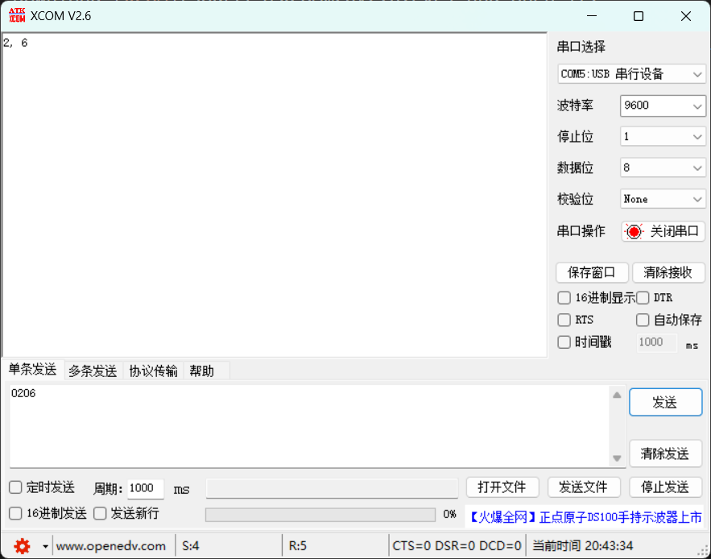

# Impedance Sensor

## Environment

```bash
pip install pyserial
```

## Hardware

Your PC should have two USB ports, or use Docking station.

1. Connect AD5933 and Digital Process Board with I^2^C wires.
2. Connect STM32F103C8T6 and MUX with Dupont wires following the rules:
    - PA0 - TEN
    - PA1~4 - TS0~3
    - PA5 - REN
    - PA6~7 + PB0~1 - RS0~3
    - Don't forget the VCC and GND
3. Make the ​alligator clips catch the corresponding T/R SIG port.
3. Connect Digital Process Board and STM32F103C8T6 to PC with USB wires.

## Test

Download [XCOM](sources/XCOM%20V2.6.exe) and open it.

Connect the the GPIO ports TChannel2 and RChannel6 with a Dupont wire.

Make sure that your configuration is as the same as mine except for the COM port:


Select the correct COM Port for STM32F103C8T6. Here, COM5 is the corresponding port. Maybe yours is different from mine.

Send '0206' to your device. Then you will receive '2, 6':



Switch to another COM port for Digital Process Board, for me it's COM6. Send 'read' to your device. If you get the impedance roughly equal to 5K, you succeed!


## Develop

Code below shows how to use pyserial to make a request for getting impedance infomation. The response consists of three lines.

For how to send MUX switch command, just refer to Test section, you can ignore the response if everything is OK, and it just consists of one line: 'Tport, Rport'.

```python
import serial
import time

ser = serial.Serial('COM6', 9600)

try:
    while True:
        time.sleep(1)
        ser.write(b'read')
        for _ in range(3):
            data = ser.readline().decode('utf-8').strip()
            print(data)

except Exception as e:
    print(f"Error: {e}")

finally:
    ser.close()
```